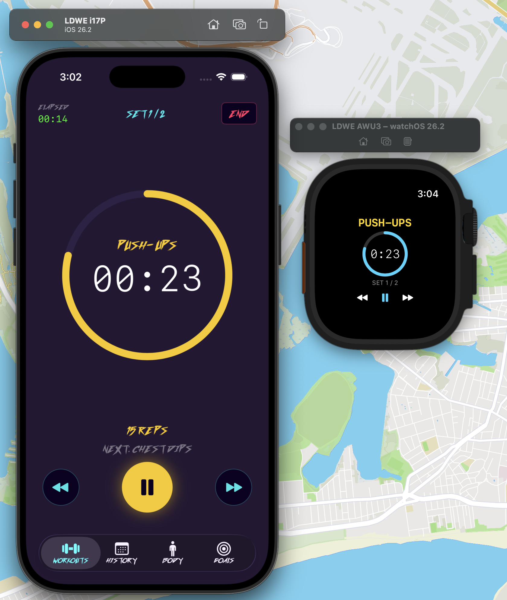
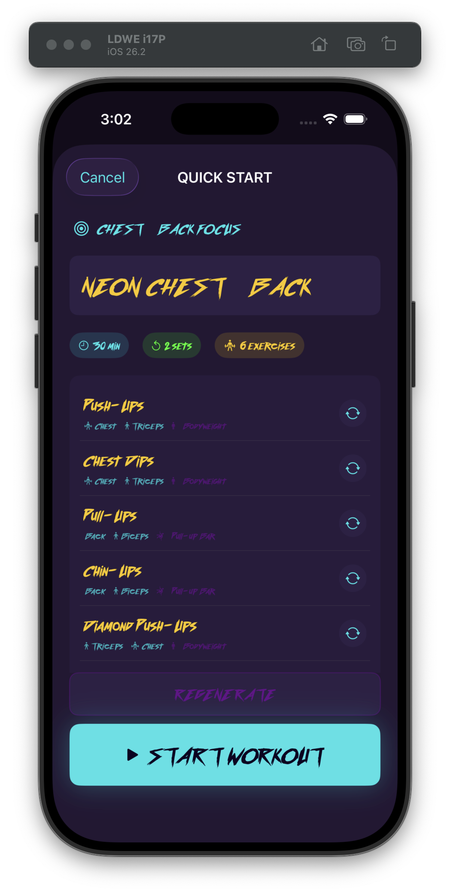
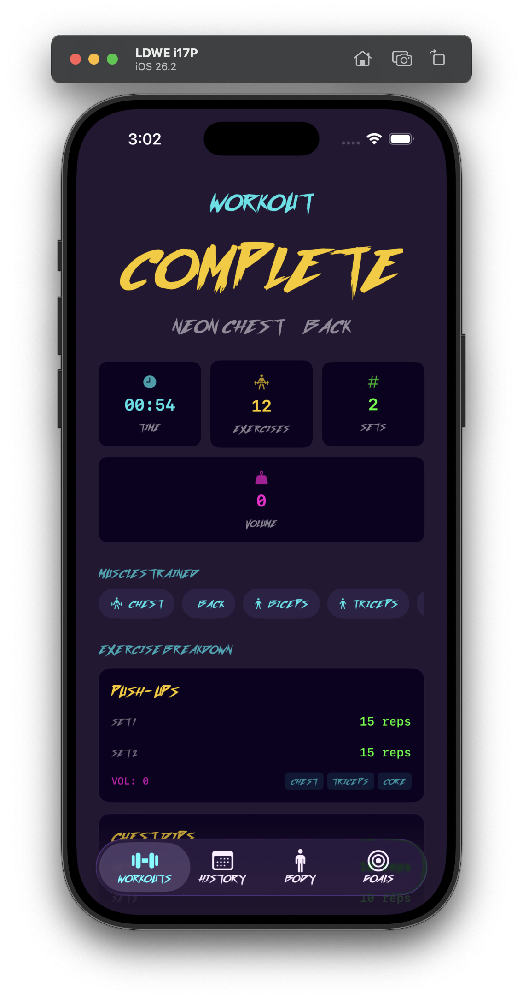
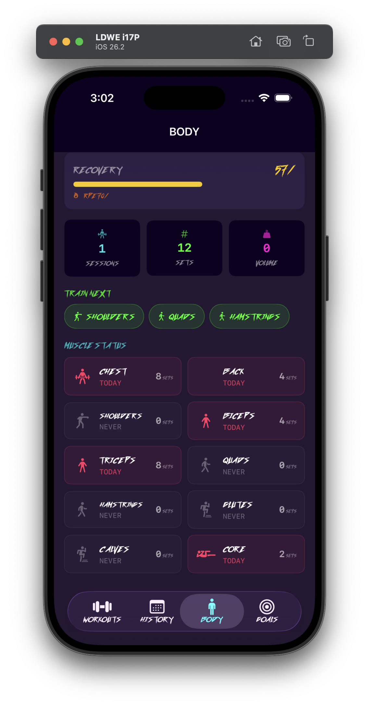

# The Lazer Dragon Workout Experience

A fully-featured iOS workout timer and training companion with an outrun/synthwave aesthetic. Built entirely in Swift with SwiftUI, SwiftData, and zero external dependencies.

[![Swift Version][swift-image]][swift-url] [![License][license-image]][license-url] [](https://developer.apple.com/ios/)

## Screenshots

| Home | Workout Builder | Workout Complete | Body Status |
|------|----------------|------------------|-------------|
|  |  |  |  |

## Features

### Workout Engine
- Interval timer with configurable warmup, exercise, rest, and cooldown phases
- Per-set logging — track weight, reps, and RPE for every set
- Progressive overload suggestions based on RPE-driven linear periodization
- Personal record detection (weight PRs and rep PRs) with animated badges
- Live Activity support on the lock screen
- Apple Watch companion app

### Exercise Intelligence
- 96 built-in exercise templates with muscle group and equipment tagging
- Custom exercise creation with user-defined muscle targets
- Searchable and filterable exercise library
- Smart Quick Start — generates workouts based on muscle freshness and available equipment
- Equipment profiles (Home Gym, Commercial Gym, or custom)

### Training Programs
- 5 built-in programs (Push/Pull/Legs, Upper/Lower, Full Body, HIIT Shred, Beginner)
- Adaptive scheduling — adjusts when you miss days
- Fatigue-aware deload suggestions
- Completion tracking with calendar grid

### Body Status
- Muscle freshness scoring — see which muscles are recovered and ready to train
- Weekly volume and set tracking
- Recovery score powered by HealthKit (sleep + HRV + RPE composite)
- Recommended muscle groups to train next

### Goals
- Set targets for weight, reps, volume, workout frequency, or body weight
- Auto-tracking from workout history for weight/rep/volume/frequency goals
- Deadline tracking with progress bars
- Auto-completion when targets are met

### History & Analytics
- Monthly calendar view with workout activity
- Per-day drill-down showing session details, volume, and muscle groups hit
- Session-over-session volume trends
- Streak tracking

### Sharing & Export
- Outrun-styled share cards (1080x1920) via ImageRenderer
- Weekly stats cards (1080x1080)
- Workout template export/import (.ldwe file format with Transferable)
- **Strava integration** — upload completed workouts directly to Strava

### Strava Integration
- OAuth2 authentication via `ASWebAuthenticationSession`
- Automatic token refresh with Keychain-backed storage
- One-tap upload from the workout completed screen
- Workout type mapping (Strength, HIIT, Run, Yoga, Custom)
- Exercise breakdown in the Strava activity description
- Connect/disconnect from the workout completed screen

## Tech Stack

| | |
|---|---|
| **Language** | Swift 5 |
| **UI** | SwiftUI |
| **Data** | SwiftData + CloudKit (automatic sync) |
| **Architecture** | MVVM with `@Observable` ViewModels |
| **Min Deployment** | iOS 18 |
| **Dependencies** | None (Fastlane for CI/CD only) |

## Project Structure

```
CodeDump/
├── AppDelegate.swift            # @main app entry, TabView, navigation routing
├── Models/
│   ├── WorkoutModel.swift       # @Model Workout + WorkoutType enum
│   ├── Exercise.swift           # @Model Exercise (muscle groups, equipment, templateID)
│   ├── WorkoutSession.swift     # @Model WorkoutSession (date, duration, completion data)
│   ├── SetLog.swift             # @Model SetLog (weight/reps/RPE per set)
│   ├── FitnessGoal.swift        # @Model FitnessGoal (auto-tracked targets)
│   ├── TrainingProgram.swift    # @Model program enrollment + schedule
│   ├── CustomExerciseTemplate.swift
│   ├── ExerciseLibrary.swift    # 96 built-in exercise templates
│   ├── MuscleAnalyzer.swift     # Muscle freshness + volume scoring
│   ├── OverloadSuggestion.swift # Progressive overload algorithm
│   ├── RecoveryAnalyzer.swift   # HealthKit sleep/HRV recovery score
│   ├── SessionAnalytics.swift   # PR detection + volume analytics
│   ├── ProgramTemplate.swift    # Built-in program definitions
│   ├── EquipmentProfile.swift   # Equipment preset management
│   ├── WorkoutTransferable.swift
│   └── Theme.swift              # Outrun color palette + fonts + extensions
└── Features/
    ├── WorkoutList/             # Home screen with Quick Start + Programs
    ├── WorkoutDetail/           # Workout preview with muscle/equipment tags
    ├── WorkoutBuilder/          # Create/edit workouts with library picker
    ├── WorkoutSession/          # Timer, set logging, Live Activity, haptics
    ├── WorkoutCompleted/        # Post-workout summary with PRs + share + Strava
    ├── WorkoutHistory/          # Calendar view + day drill-down
    ├── ExerciseLibrary/         # Searchable exercise browser + custom builder
    ├── QuickStart/              # Smart workout generation
    ├── Programs/                # Training program browse/enroll/calendar
    ├── Body/                    # Muscle freshness + recovery dashboard
    ├── Goals/                   # Goal tracking + creation
    ├── Sharing/                 # Share cards + template export
    ├── Strava/                  # Strava OAuth + activity upload
    └── Settings/                # Equipment profile setup
```

## Getting Started

```bash
# 1. Clone and setup
git clone https://github.com/nsluke/Lazer-Dragon-Workout-Experience.git
cd Lazer-Dragon-Workout-Experience
./scripts/setup.sh

# 2. Open in Xcode
open CodeDump.xcodeproj   # NOT .xcworkspace

# 3. Build & run (iOS 18+)
```

**iCloud sync** requires adding the iCloud capability in Signing & Capabilities with container `iCloud.com.lazerdragon.ldwe`.

### Strava Setup

1. Register your app at [Strava API Settings](https://www.strava.com/settings/api)
2. Set the Authorization Callback Domain to `ldwe`
3. Update `StravaManager.swift` with your `clientID` and `clientSecret`

## Testing

The project has a comprehensive test suite organized into 9 categories:

### Test Categories

| Category | File | Count | Runs In |
|----------|------|-------|---------|
| **Unit** | `StravaManagerTests.swift` | 45 | Every PR |
| **Integration** | `StravaIntegrationTests.swift` | 18 | Every PR |
| **Contract** | `StravaContractTests.swift` | 16 | Every PR |
| **Error Injection** | `StravaErrorInjectionTests.swift` | 30 | Every PR |
| **Concurrency** | `StravaConcurrencyTests.swift` | 11 | Every PR |
| **Accessibility** | `StravaAccessibilityTests.swift` | 15 | Every PR |
| **Snapshots** | `StravaSnapshotTests.swift` | 6 | Every PR |
| **Keychain** | `StravaKeychainTests.swift` | 15 | Post-merge |
| **UI (XCUITest)** | `StravaUITests.swift` | 6 | Every PR |
| **E2E** | `StravaE2ETests.swift` | 5 | Nightly / Release |

### Running Tests

```bash
# Run all fast tests with coverage
./scripts/check-coverage.sh

# Run via Fastlane gates
bundle exec fastlane gate_pr         # Gate 1: PR validation
bundle exec fastlane gate_merge      # Gate 2: Post-merge
bundle exec fastlane gate_nightly    # Gate 3: Nightly (multi-device + E2E)
bundle exec fastlane gate_release    # Gate 4: Full release pipeline

# Record snapshot baselines
bundle exec fastlane record_snapshots

# Run specific test suites
xcodebuild test -project CodeDump.xcodeproj -scheme CodeDump \
  -destination "platform=iOS Simulator,name=iPhone 16 Pro" \
  -only-testing:CodeDumpTests/StravaContractTests
```

## Release Architecture

The project uses a 4-gate release pipeline. Code must pass each gate before advancing:

```
Feature Branch → PR → Merge to master → Nightly → Release
       │          │          │              │          │
       ▼          ▼          ▼              ▼          ▼
    Gate 0     Gate 1     Gate 2        Gate 3     Gate 4
   (local)     (CI)       (CI)         (scheduled)  (manual)
```

### Gate 0: Local (pre-push hook)
- Compile check + unit tests + coverage threshold
- Installed via `./scripts/setup.sh` or `bundle exec fastlane install_hooks`
- Blocks `git push` if tests fail or coverage drops

### Gate 1: Pull Request (CI)
- **Unit + Integration + Contract + Concurrency + Accessibility + Error Injection** tests
- **UI tests** (parallel job)
- **Snapshot tests** (parallel job)
- **Code coverage enforcement** (70% minimum, reported in PR summary)
- All 3 jobs must pass for PR to be mergeable

### Gate 2: Post-Merge (CI)
- Full test suite including Keychain integration tests
- Runs on every push to `master`
- Catches issues from merge conflict resolution

### Gate 3: Nightly (scheduled CI)
- Multi-device matrix (iPhone SE, iPhone 16 Pro, iPhone 16 Pro Max)
- UI tests on all device sizes
- E2E tests against real Strava API (if secrets configured)
- Runs daily at 6 AM UTC

### Gate 4: Release (manual CI)
- Everything from gates 1-3
- Multi-device UI validation
- Archive build verification
- TestFlight upload (when signing is configured)
- Triggered manually via GitHub Actions with version bump selection

### CI Workflows

| File | Trigger | What it does |
|------|---------|--------------|
| `tests.yml` | PR + push to master | Gates 1 and 2 |
| `nightly.yml` | Daily 6 AM UTC + manual | Gate 3: multi-device + E2E |
| `release.yml` | Manual dispatch | Gate 4: full validation + build |

### GitHub Secrets Required

| Secret | Required For | Description |
|--------|-------------|-------------|
| `STRAVA_TEST_CLIENT_ID` | E2E tests | Strava API test app client ID |
| `STRAVA_TEST_CLIENT_SECRET` | E2E tests | Strava API test app client secret |
| `STRAVA_TEST_REFRESH_TOKEN` | E2E tests | Refresh token from a test Strava account |
| `ASC_KEY_ID` | Release | App Store Connect API key ID |
| `ASC_ISSUER_ID` | Release | App Store Connect API issuer ID |
| `ASC_PRIVATE_KEY` | Release | App Store Connect API private key |
| `MATCH_PASSWORD` | Release | Fastlane match encryption password |

## Custom Fonts

- **OutrunFuture** — primary display font used throughout the app
- **MorningStar** and **Mozart** — available for future use

Fonts are registered in `Info.plist` and accessed via `Font.outrunFuture(_ size:)`.

[swift-image]: https://img.shields.io/badge/swift-5-orange.svg
[swift-url]: https://swift.org/
[license-image]: https://img.shields.io/badge/License-MIT-blue.svg
[license-url]: LICENSE
